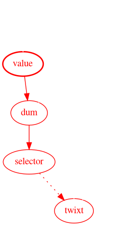
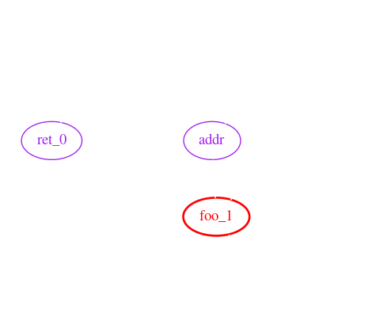
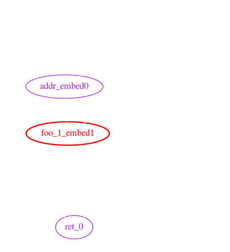
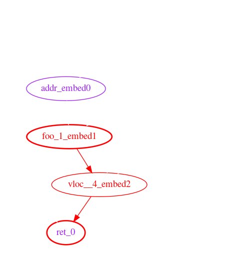
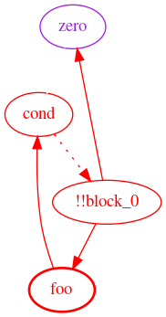

+++
title = "Automated Detection of Dynamic State Access in Solidity"
date = 2020-02-21T18:39:00Z
+++
_Originally posted on [ethresear.ch](https://ethresear.ch/t/automated-detection-of-dynamic-state-access-in-solidity/7003)._

## Introduction

Deciding to support only static state access (SSA) or to support full dynamic state access (DSA) is one of the remaining open questions on the Eth2 roadmap. If a purely SSA system proves feasible, there are a number of benefits that simplify:
  - State providers;
  - Synchronous communication between execution environments;
  - Account abstraction; and
  - Transaction pools, witness aggregation and refreshes.

Continuing the exploration of state provider models described [earlier][sps], we have roughly prototyped a modification to the solidity compiler that can detect instances of DSA in smart contracts using taint analysis.

This proof of concept shows that it is possible to build tooling to support a purely SSA Ethereum.

[sps]: https://ethresear.ch/t/state-provider-models-in-ethereum-2-0/6750

## Background

### State Access & Witnesses

For the direct push state provider model to work, the actor creating the transaction should be able to build a witness (such as a Merkle proof) to every storage location the transaction will read or write. If the transaction *does* read from or write to a location not included in the witness, the transaction is reverted, and its fees are forfeit.

DSA is a particularly problematic issue that can lead to an insufficient witness. In concrete terms, DSA occurs when the `offset` argument to `sload` or `sstore` is influenced by a previous `sload` result.

A short classification of some types of DSA, with solidity examples, can be found [here][dsa-gist].

[dsa-gist]: https://gist.github.com/SamWilsn/369de587ac7373c8f77ed26079531671

### Yul Language

Example code in this article is written in pseudocode loosely resembling EVM-flavored [Yul][yul], an internal representation language used in the solidity compiler. The prototype is written as an optimization pass that operates on Yul.

[yul]: https://solidity.readthedocs.io/en/v0.6.3/yul.html

### Taint Analysis

Taint analysis (or [taint checking][taint]) is a type of data flow analysis where "taint" flows from an upstream source into all downstream variables. It is commonly used in web applications, where user supplied values (like headers) are the source of taint, and variables used in database queries are verified to be taint-free.

In a compiled language, it is conceptually similar to symbolic execution, though much less complex.

Consider the following example, where `value` is tainted by an `sload`:

```yul
function tweedle() -> twixt
{
    let zero := 0
    let value := sload(zero)
    let dee := 45
    let dum := add(dee, value)
    let rattle := 88

    let selector := gt(dum, 100)

    switch selector
    case 0 {
        twixt := dee
    }
    default {
        twixt := rattle
    }
}
```

The graph below shows the flow of taint from `value` all the way to `twixt`. Red nodes and edges indicate taint, and dotted lines represent indirect influence (in this case, through the `switch`.)



[taint]: https://en.wikipedia.org/wiki/Taint_checking

## Prototype

### Implementation

Implementation source code is available for [solidity 0.5][solc-5] and for [solidity 0.6][solc-6], though not all features are implemented on both branches. Test cases can be found [here][tests], though not all successfully pass. This prototype is built as a Yul optimization pass, and so requires `--optimize-yul --ir` as additional compiler flags.

Since this is a proof of concept, the output is messy and barely readable, the implementation is inefficient, and is 100% capable of summoning [nasal demons][undefined]. Obviously, don't use this software in any kind of production environment.

The analysis can be split into three conceptual phases: data gathering, function resolution, and taint checking.

[solc-5]: https://github.com/SamWilsn/solidity/blob/state-taint-0.5.16/libyul/optimiser/OrderDependentStateDestroyer.cpp
[solc-6]: https://github.com/SamWilsn/solidity/blob/state-taint/libyul/optimiser/OrderDependentStateDestroyer.cpp
[undefined]: https://en.wikipedia.org/wiki/Undefined_behavior
[tests]: https://github.com/SamWilsn/taint-tests

#### Data Gathering

In the data gathering phase, the analyzer visits each node in the Yul abstract syntax tree (AST). This phase accomplishes several goals:

 * Creates a scope for each function;
 * Tracks variable assignments, declarations, and function calls;
 * Tracks return variables and arguments of `sload` and `sstore`;
 * Resolves the effects of built-in functions (ex. `add`, `iszero`);
 * Propagates constant values; and
 * Converts memory accesses into special variables.

The following is a simplified example of the information collected for the given input:

```yul
{
    let zero := 0
    let ret_0 := fun_narf_19()
    sstore(ret_0, zero)

    function fun_narf_19() -> vloc__4
    {
        let addr := 97
        let foo_0 := 54
        let foo_1 := sload(addr)

        vloc__4 := add(foo_0, foo_1)
    }
}
```

The collected output:

```
Known Variables:
    addr         [constant=97] [Untaintable]
    ret_0                      [Untaintable]
    zero         [constant=0]
    vloc__4
    foo_0        [constant=54]
    foo_1                      [Tainted]
    !!block_0    [constant]

Functions:
	!!main() ->
		Data Flow:
			!!block_0            -> zero, ret_0,
		Unresolved Function Calls:
			- fun_narf_19

	fun_narf_19() -> vloc__4,
		Data Flow:
			addr                 -> foo_1,
			foo_1                -> vloc__4,
			foo_0                -> vloc__4,
			!!block_0            -> addr, foo_1, foo_0, vloc__4,
```



The variable `!!block_0` is synthesized to represent indirect influence, such as `if` statements and loops. This example does not contain any indirect influence, though the block variables are still created. The `!!main` function represents statements not contained in any other function, like the `sstore` in the example code.

Data flow, in the example output, shows how data flows from upstream variables (to the left of `->`) to downstream variables (on the right.)

Note that `fun_narf_19` is listed as an unresolved function call.

##### A Note on Memory

Memory accesses are tracked by synthesizing variables (ex. `!!m0`) for every `mstore`, similar to how compilers convert to [single static assignment][ssa] form. This process relies on very basic [constant folding][const]. Should an `mstore` or an `mload` access an offset which is not computable at compile time or has not been written to yet, a catch-all variable `!!memory` is used instead.

[ssa]: https://en.wikipedia.org/wiki/Static_single_assignment_form

#### Function Resolution

The function resolution phase iteratively embeds callee function scopes into the caller's scope, uniquely renaming variables in the data flow graph. Embedding functions in this way allows accurate tracing between arguments and return variables.

Continuing with the above example, the data flow graph after this phase looks like:

```
Functions:
	!!main() ->
		Data Flow:
			!!block_0            -> zero, ret_0, addr_embed0, foo_1_embed1, foo_0_embed3, vloc__4_embed2
			addr_embed0          -> foo_1_embed1,
			foo_1_embed1         -> vloc__4_embed2,
			foo_0_embed3         -> vloc__4_embed2,
			vloc__4_embed2       -> ret_0
```



#### Taint Checking

Last, and probably simplest, is taint checking. This phase walks through the data flow graph, tainting every variable that is reachable from an initially tainted variable.

Once the taint is propagated, the "protected" variables (variables used as the key argument to an `sload` or `sstore`) are checked for taint. If tainted protected variables are found, a taint violation exception is thrown.

In this example, `ret_0` is both protected and tainted.



### Limitations & Future Work

#### Call Graph Cycles

A call graph cycle happens when a function `foo` calls a function `bar` and `bar` also calls `foo`. For example:

```yul
function foo(arg0) -> ret0 {
    switch arg0
    case 0 {
        ret0 := bar()
    }
    default {
        ret0 := 1
    }
}

function bar() -> ret1 {
    ret1 := foo(1)
}
```

Cycles in the call graph currently cause the prototype to loop infinitely. It should be possible to break these cycles by assuming all parameters of one function influence all of that function's return variables.

#### Constant Propagation

[Constant propagation][const] is the process of substituting the values of known constants in expressions at compile time.

This prototype implements a very limited form of constant propagation to support the `mstore` and `mload` instructions. If the offset argument to `mstore` or `mload` can be computed at compile time, the taint analysis through memory is more accurate (fewer misleading taint violations.)

[const]: https://en.wikipedia.org/wiki/Constant_folding#Constant_folding

#### Calling Contracts

The builtin functions to call other contracts are disabled in the prototype. Enabling them requires further thought on the ABI between contracts.

Currently the prototype assumes that call data opcodes (`CALLDATALOAD`, `CALLDATASIZE`, `CALLDATACOPY`, etc) return untainted data. If a contract calls another contract, that assumption is invalidated.

#### Control Flow

The approach taken in this prototype to handle control flow and branching (synthesizing `!!block` variables) is insufficient to accurately trace taint through loops.

Consider the following:

```yul
function fizzbuzz() {
    for { } 1 { }
    {
        let zero := 0
        let foo := sload(zero)
        let cond := eq(foo, zero)
        if cond {
            break
        }
    }
}
```

Which roughly translates to the following data flow graph:



`zero` is not influenced by `!!block_0` between where it is assigned and where it is used for `sload`. In other words, `zero` is not dependent on `storage[0]` at the time `sload` is called, even though the data flow graph thinks it is.

#### Bit-Accurate Taint

Variables in the prototype are tracked as an indivisible unit, which may be tainted or clean. Tracking each bit of a variable separately enables more accurate analysis.

This improvement is particularly relevant when using boolean operations (like `or` & `and`) and the `mload` instruction with non-256 bit types.

For example, the following snippet does not exhibit any DSA, though the prototype will report a taint violation:

```yul
function fizzbuzz(value)
{
    // Place a constant byte into memory.
    mstore(0, 0xAB)

    // Read a value from storage, place it into memory. This
    // taints memory offsets 1 through 32 inclusive.
    let from_storage := sload(0)
    mstore(1, from_storage)

    // Get the constant back from memory.
    let mem_tainted := mload(0)
    let mem_cleaned := and(mem_tainted, 0xFF)

    sstore(mem_cleaned, 0xC0FFEE)
}
```

After execution, the first 33 bytes of memory look like:


Since `mload(0)` populates `mem_tainted` with the first 32 bytes of memory, `mem_tainted` contains 31 tainted bytes (all bytes after `memory[0]`). `mem_cleaned`, on the other hand, contains no tainted bytes, since only the first byte can influence its value; the other bits are masked out by `and`.

#### Unimplemented Features in Yul

The solidity compiler's Yul implementation doesn't yet support libraries. This makes analyzing existing contracts tedious at best.

## Conclusions

Although the limitations mentioned above present challenges for analyzing existing contracts for DSA, we believe that existing compilers **can** be extended, with reasonable effort, to detect and prevent DSA while maintaining features. Furthermore, given the ease of inadvertently introducing DSA, we believe that adding this feature to smart contract compilers is **necessary** to write secure code.

[One contract][ERC20], part of [@PhABC][PhABC]'s uniswap-solidity, did successfully compile with minimal modification.

A big thanks to Quilt for supporting this research and providing invaluable review and feedback.

[PhABC]: https://ethresear.ch/u/phabc/summary
[ERC20]: https://github.com/PhABC/uniswap-solidity/blob/2434367a66b6091db7b808ed91e7ade61fad6f7d/contracts/tokens/ERC20.sol
