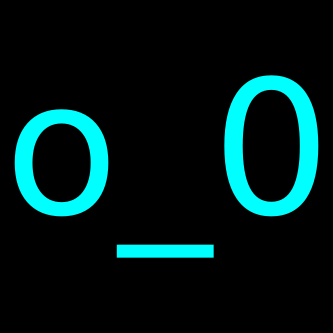

+++
title = "Rendering a PNG on Ethereum: face.png"
date = 2021-09-06T04:25:00Z
+++

<style>
pre {
line-height: 1.3em !important;
}
</style>


How do you create a PNG image dynamically in Solidity? How do you make it into a
non-fungible token? Why would you create such an abomination? Why are they
blurry in safari?

The answer to some of these questions below!

---

at the time of writing, there are still ~40 left on
[facepng.art](https://facepng.art)

---

## Motivation

### Why a PNG?

<blockquote class="twitter-tweet" data-dnt="true" data-theme="dark"><p lang="en" dir="ltr">Everyone is making NFTs that generate their artwork on chain using SVG, but nobody is making ones that generate PNGs onchain.</p>&mdash; nick.eth (@nicksdjohnson) <a href="https://twitter.com/nicksdjohnson/status/1431144024052690944?ref_src=twsrc%5Etfw">August 27, 2021</a></blockquote> 

This is the tweet, right here.

I'm not sure if Nick knows it, but he [nerd sniped][snipe] me out of my entire
weekend.

### Why an NFT?

All my friends and colleagues were getting [cool][msb] [non-fungible][punks]
[tokens][tulip] (NFTs) and using them as profile pictures on Twitter and GitHub
and I felt left out, but I _really_ like my profile picture:



I wanted to have my cake and eat it too: participating in the NFT hype, and not
giving up my "brand".

Making a one-of-one collectible is pretty boring though, so this one is
generative! Nothing too fancy, just choosing a couple properties and combining
them, which is a good exercise for doing the encoding on-chain anyway.

So I settled on a small run of procedurally generated character art faces, with
all the metadata and image data stored and calculated on-chain. Because I suffer
from chronic laziness, I picked out seven eyes and three noses, giving a total
supply of 147 faces. Not exactly a huge collection, but that's half the fun of
collectibles anyway. To keep things recognizable, each face is unique based on
the characters (and ignores the colors.)

## Implementation

### Anatomy of a PNG Image

Portable Network Graphics (PNG) images are a mainstay of the internet. `libpng`
maintains a [specification of the format][spec] that goes into a lot more depth,
and if you're extremely interested in the fine details, I'd recommend reading
it. The following hack job is my attempt to cover the parts important to
generating the _simplest_ PNG image I could think of, but I'll try to link to
the relevant portions of the specification as we go along.

#### File Signature

The first eight bytes of the file identify the file as a PNG image[^1]:

```
+----+----+----+----+----+----+----+----+---
| 89 | 50 | 4e | 47 | 0d | 0a | 1a | 0a |
+----+----+----+----+----+----+----+----+---
```

There's actually some really cool tricks in the signature to detect various
forms of corruption and transmission errors. For our purposes, the signature is
just a static array of eight bytes to copy.

#### Chunks!

After the signature the PNG file is divided into chunks.[^2] Each chunk has a
four byte length, four byte type, some data, and a four byte [cyclic redundancy
check][crc] (CRC):

```
---+--+--+--+--+--+--+--+--+--===--+--+--+--+--+---
   | Length    | Type      | Data  | CRC       |
---+--+--+--+--+--+--+--+--+--===--+--+--+--+--+---
```

There are four chunks we need to pay attention to: `IHDR`, `PLTE`, `IDAT`, and
`IEND`.

##### `IHDR` Chunk

The `IHDR` chunk, which I assume means image header, immediately follows the
signature and contains metadata about the image itself:


```
---+--+--+--+--+--+--+--+--+---+---+---+---+---+---
   | Width     | Height    | D | C | Z | F | I |
---+--+--+--+--+--+--+--+--+---+---+---+---+---+---

D: Bit Depth
C: Color Type
Z: Compression Method
F: Filter Method
I: Interlace Method
```

_Width_ and _height_ are pretty self-explanatory, _bit depth_ is the number of
bits per sample (or palette index), color type determines how colors are
represented in the image data, _compression method_ is always zero (for
DEFLATE[^3]), filter method chooses a transform to apply to the image data
before compression, and the _interlace method_ indicates how the data is ordered
(so it can be rendered while being transferred.)

For our purposes, filter[^4] and interlace[^5] will always be zero for the
default filter and no interlacing respectively. Since the images I want to
encode are fairly simple&mdash;basically pixel art&mdash;we can use the palette
(`3`) color type with a bit depth of `1`.

```
Width = 48
Height = 48
Bit Depth = 1
Color Type = 3
Compression Method = 0
Filter Method = 0
Interlace Method = 0
```

With the chunk header and CRC, the `IHDR` chunk ends up as another static block
of bytes:

```
---++----+----+----+----++----+----+----+----++----+----+----+----++----+----+----+----++----++----++----++----++----++-------------------++---
   || Length            || Type              || Width             || Height            || D  || C  || Z  || F  || I  || CRC               ||
---++----+----+----+----++----+----+----+----++----+----+----+----++----+----+----+----++----++----++----++----++----++----+----+----+----++---
   || 00 | 00 | 00 | 0d || 49 | 48 | 44 | 52 || 00 | 00 | 00 | 30 || 00 | 00 | 00 | 30 || 01 || 03 || 00 || 00 || 00 || 6d | cc | 6b | c4 ||
---++----+----+----+----++----+----+----+----++----+----+----+----++----+----+----+----++----++----++----++----++----++----+----+----+----++---
```

##### `PLTE` Chunk

The `PLTE` chunk[^6] holds an array of colors which can be referenced by index
in the image data. Interestingly, this chunk is our first bit of dynamic data
that needs to be constructed at runtime.

Inside the `PLTE` chunk's data, we have each color encoded as three values: red,
green, and blue. In `face.png`, we have only a foreground and a background
color, so the `PLTE` length will be six.

Color is a generated attribute, so we can't just hard code the `PLTE` chunk, it
has to be calculated on the fly.

First the static portion:

```solidity
bytes constant private HEADER =
    hex"89504e470d0a1a0a"                                       // PNG Signature
    hex"0000000d49484452000000300000003001030000006dcc6bc4"     // IHDR Chunk
    hex"00000006504c5445";                                      // PLTE Chunk (Partial)
```
[_source_](https://github.com/SamWilsn/face.png/blob/71ce0f7ff40ed3c50a00708e7b70abef70829f2f/contracts/render.sol#L589)

Then we copy the colors, and compute the checksum:

```solidity
uint offset = 0;

// Copy the static portion of the header.
for (uint ii = 0; ii < HEADER.length; ii++) {
    output[offset++] = HEADER[ii];
}

// Copy the background color.
for (uint ii = 0; ii < bg.length; ii++) {
    output[offset++] = bg[ii];
}

// Copy the foreground color.
for (uint ii = 0; ii < fg.length; ii++) {
    output[offset++] = fg[ii];
}

// Compute the palette's checksum.
output.crc32(HEADER.length - 4, offset);
offset += 4;
```
[_source_](https://github.com/SamWilsn/face.png/blob/71ce0f7ff40ed3c50a00708e7b70abef70829f2f/contracts/render.sol#L730)

Finally, the checksum implementation itself:

```solidity
library Crc32 {
    bytes constant private TABLE = hex"[snip]";

    function table(uint index) private pure returns (uint32) {
        unchecked {
            index *= 4;

            uint32 result =
                uint32(uint8(TABLE[index    ])) << 24;
            result |= uint32(uint8(TABLE[index + 1])) << 16;
            result |= uint32(uint8(TABLE[index + 2])) << 8;
            result |= uint32(uint8(TABLE[index + 3]));
            return result;
        }
    }

    function crc32(bytes memory self, uint offset, uint end) internal pure {
        unchecked {
            uint32 crc = ~uint32(0);

            for (uint ii = offset; ii < end; ii++) {
                crc = (crc >> 8) ^ table((crc & 0xff) ^ uint8(self[ii]));
            }

            crc = ~crc;

            self[end    ] = bytes1(uint8(crc >> 24));
            self[end + 1] = bytes1(uint8(crc >> 16));
            self[end + 2] = bytes1(uint8(crc >> 8));
            self[end + 3] = bytes1(uint8(crc));
        }
    }
}
```
[_source_](https://github.com/SamWilsn/face.png/blob/71ce0f7ff40ed3c50a00708e7b70abef70829f2f/contracts/render.sol#L5)

Length, identifier, bunch of colors, and a checksum. That's about it for the
palette.

##### `IDAT` Chunk

The `IDAT` (or image data) chunk[^7] is where the real magic happens. In a more
traditional PNG image, the encoder does some fancy magic to figure out what
filters[^8] to apply, then compresses the data, and writes it out.

In our grossly simplified encoder we wrap the image data in a zlib stream
without any compression:

```
---++----++----++-===--++----+----+----+----++---
   || M  || F  || Data || Adler32           ||
---++----++----++-===--++----+----+----+----++---
   || 78 || 01 || ...  || ?? | ?? | ?? | ?? ||
---++----++----++-===--++----+----+----+----++---

M: Compression method/flags code
F: Additional flags/check bits
```

The image data itself is 48 rows of 7 bytes. The first byte of each row is the
filter mode, which is always zero for `face.png`. The remaining 6 bytes are the
actual image data, which is divided into three chunks&mdash;the left eye, nose,
and right eye. Each bit of the image data represents an index into the palette
from the `PLTE` chunk, and here a zero is the background, and a one is the
foreground.

Each segment is encoded as a byte array constant in Solidity:

```solidity
bytes constant private EYES_CRY =
    hex"0000"
    hex"0000"
    hex"0000"
    hex"0000"
    hex"0000"
    hex"0000"
    hex"0000"
    hex"0000"
    hex"0000"
    hex"0000"
    hex"0004"
    hex"0004"
    hex"0002"
    hex"0002"
    hex"0002"
    hex"0006"
    hex"3ffe"
    hex"7ffc"
    hex"0630"
    hex"1818"
    hex"108c"
    hex"31c6"
    hex"21c6"
    hex"6086"
    hex"6006"
    hex"6006"
    hex"310e"
    hex"3ffc"
    hex"1e78"
    hex"0000"
    hex"0100"
    hex"0180"
    hex"0380"
    hex"0380"
    hex"0100"
    hex"0000"
    hex"0000"
    hex"0000"
    hex"0000"
    hex"0000"
    hex"0000"
    hex"0000"
    hex"0000"
    hex"0000"
    hex"0000"
    hex"0000"
    hex"0000"
    hex"0000";
```

[_source_](https://github.com/SamWilsn/face.png/blob/71ce0f7ff40ed3c50a00708e7b70abef70829f2f/contracts/render.sol#L384)

`EYES_CRY` would render into something like:


Concatenate together each row of each template image, and you have your image
data!

```solidity
function render(bytes memory output, uint offset, uint8 leftEyeIndex, uint8 noseIndex, uint8 rightEyeIndex) private pure {
    unchecked {
        bytes memory sprite;

        sprite = eye(leftEyeIndex);

        for (uint line = 0; line < LINES; line++) {
            uint inOffset = line * SPRITE_LINE_BYTES;
            uint outOffset = 1 + (line * (WIDTH_BYTES + 1));

            for (uint column = 0; column < SPRITE_LINE_BYTES; column++) {
                output[offset + outOffset + column] = sprite[inOffset + column];
            }
        }

        sprite = nose(noseIndex);

        for (uint line = 0; line < LINES; line++) {
            uint inOffset = line * SPRITE_LINE_BYTES;
            uint outOffset = 1 + SPRITE_LINE_BYTES + (line * (WIDTH_BYTES + 1));

            for (uint column = 0; column < SPRITE_LINE_BYTES; column++) {
                output[offset + outOffset + column] = sprite[inOffset + column];
            }
        }

        sprite = eye(rightEyeIndex);

        for (uint line = 0; line < LINES; line++) {
            uint inOffset = line * SPRITE_LINE_BYTES;
            uint outOffset = 1 + (2 * SPRITE_LINE_BYTES) + (line * (WIDTH_BYTES + 1));

            for (uint column = 0; column < SPRITE_LINE_BYTES; column++) {
                output[offset + outOffset + column] = sprite[inOffset + column];
            }
        }
    }
}
```
[_source_](https://github.com/SamWilsn/face.png/blob/71ce0f7ff40ed3c50a00708e7b70abef70829f2f/contracts/render.sol#L677)

Since the "compressed" and original data are the same, we can compute the
[adler32][adler] checksum over the same bytes. The adler32 checksum in Solidity
looks something like:

```solidity
library Adler32 {
    uint32 constant private MOD = 65521;

    function adler32(bytes memory self, uint offset, uint end) internal pure {
        unchecked {
            uint32 a = 1;
            uint32 b = 0;

            // Process each byte of the data in order
            for (uint ii = offset; ii < end; ii++) {
                    a = (a + uint32(uint8(self[ii]))) % MOD;
                    b = (b + a) % MOD;
            }

            uint32 adler = (b << 16) | a;

            self[end    ] = bytes1(uint8(adler >> 24));
            self[end + 1] = bytes1(uint8(adler >> 16));
            self[end + 2] = bytes1(uint8(adler >> 8));
            self[end + 3] = bytes1(uint8(adler));
        }
    }
}
```
[_source_](https://github.com/SamWilsn/face.png/blob/71ce0f7ff40ed3c50a00708e7b70abef70829f2f/contracts/render.sol#L39)

Then to finish off the `IDAT` chunk, we compute the crc32 checksum the same way
we did for the `PLTE` chunk.

##### `IEND` Chunk

The `IEND`, or image trailer, chunk[^9] finishes off the rendered PNG. This
chunk is just a constant:

```solidity
bytes constant private TRAILER = hex"0000000049454e44ae426082"; // IEND Chunk
```
[_source_](https://github.com/SamWilsn/face.png/blob/71ce0f7ff40ed3c50a00708e7b70abef70829f2f/contracts/render.sol#L599)

That basically an entire PNG rendered dynamically on-chain.

We did take a couple shortcuts:

 * Fixed size/bit depth/color format
 * No compression
 * Only two colors

But technically these are valid PNG images!

### Challenges

There were some interesting challenges that came up, some in tooling, some in
implementation, and some in the marketplace!

#### Tooling Issues

While remix and `solc` have no trouble compiling `render.sol`, [hardhat] seems
to have a memory leak and crashes.

The JavaScript VM in remix will hang if you attempt to render a PNG, at least in
Firefox. I suspect that all the `BigNumber` math is messing things up.

#### Implementation Issues

I am not a Solidity developer by trade, so a lot of this was new to me. Having
to manually implement slices and `memcpy`-type primitives was tedious and I'm
sure I made mistakes.

I'd really like to see full support for slices and slice copies, so that it's
possible to write something like:

```solidity
contract Demo {
    bytes constant FOO = hex"......";

    function copy(uint offset) private pure returns (bytes memory) {
        return FOO[offset : offset + 3];
    }
}
```

#### Marketplace Issues

While I might write another post on the topic of [ERC-721 metadata][meta], one
of the biggest and most annoying issues I encountered was in the encoding of
images into a data URL (yes, [data UR**L**][durl]), nested in JSON, also
encoded into another data URL.

The primary marketplace I used to test `face.png` is [OpenSea]. OpenSea is a
pretty decent website, which is why I was quite surprised they don't support
rendering PNG images in data URLs (eg. `data:image/png;base64,...`) directly,
but do support PNG images embedded in an SVG image.

If you're curious why you get an SVG when you `Save As...` your favourite
`face.png`s from OpenSea, this is why.

So we have a PNG, encoded into base64, packed into an SVG, encoded into base64,
packed into JSON, ALSO ENCODED INTO BASE64!


## `IEND` (The End)

Thanks for taking the time to read about my wasted (but quite enjoyable)
weekend! If you bought a token, I really appreciate it, but don't quite
understand why.

If this post gets some attention, I might write a post on the token itself, on
the random number algorithm I used for attributes, and possibly even on the
terrible tooling I built around this project. Stay tuned, and happy hacking!


---

[facepng.art](https://facepng.art) if you want a face of your own

---

[durl]: https://developer.mozilla.org/en-US/docs/Web/HTTP/Basics_of_HTTP/Data_URIs
[meta]: https://eips.ethereum.org/EIPS/eip-721
[OpenSea]: https://opensea.io/collection/face-png
[hardhat]: https://hardhat.org/
[crc]: https://en.wikipedia.org/wiki/Cyclic_redundancy_check
[tulip]: https://ethertulips.com/
[punks]: https://www.larvalabs.com/cryptopunks
[msb]: https://bots.moonshotcollective.space/
[nft]: https://ethereum.org/en/nft/
[snipe]: https://xkcd.com/356/
[spec]: http://www.libpng.org/pub/png/spec/1.2/PNG-Contents.html

## References

[^1]: [PNG file signature](http://www.libpng.org/pub/png/spec/1.2/PNG-Structure.html#PNG-file-signature)

[^2]: [Chunk layout](www.libpng.org/pub/png/spec/1.2/PNG-Structure.html#Chunk-layout)

[^3]: [PNG Compression](http://www.libpng.org/pub/png/spec/1.2/PNG-Compression.html)

[^4]: [Filtering](http://www.libpng.org/pub/png/spec/1.2/PNG-DataRep.html#DR.Filtering)

[^5]: [Interlaced data order](http://www.libpng.org/pub/png/spec/1.2/PNG-DataRep.html#DR.Interlaced-data-order)

[^6]: [PTLE](http://www.libpng.org/pub/png/spec/1.2/PNG-Chunks.html#C.PLTE)

[^7]: [IDAT](http://www.libpng.org/pub/png/spec/1.2/PNG-Chunks.html#C.IDAT)

[^8]: [PNG Filters](http://www.libpng.org/pub/png/spec/1.2/PNG-Filters.html)

[^9]: [IEND](http://www.libpng.org/pub/png/spec/1.2/PNG-Chunks.html#C.IEND)

<script async src="https://platform.twitter.com/widgets.js" charset="utf-8"></script>
