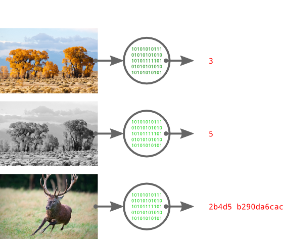

+++
title = "DIY Image Search: Part 1 - Introduction"
date = 2012-06-24T01:16:00Z

aliases = ['/2012/06/diy-image-search-part-1-introduction.html']
+++

I'm sure everyone has had an awesome picture lying around on their hard drive for what seems like forever, with a gibberish file name and no clues as to the source.  Most people would simply navigate to a site like [TinEye][te] and use their awesome service to identify the image and find a source.  Not you, you're interested in building some kind of software hacked together with ducktape and string, or else why would you be reading this?

I'm going to be flying by the seat of my pants for this series, and I'm giving very little forethought to future posts.  Things probably will be changing dramatically as I progress through this project, so I'm going to apologise in advance if everything isn't as contiguous as it should be.

[te]: https://www.tineye.com/

## The Tools

To build this monstrosity, I'm going to use a couple of interesting projects: [pHash][phash] and [py-pHash][pyphash], [django][django] and [django-orm][django-orm], and [PostgreSQL][psql] with the [smlar][smlar] extension.  I won't be going over django or PostgreSQL, so if they are foreign to you, take some time to learn about them.

[phash]: http://phash.org/
[pyphash]: https://github.com/polachok/py-phash
[django]: https://www.djangoproject.com/
[django-orm]: http://www.niwi.be/post/project-django-orm/
[psql]: http://www.postgresql.org/
[smlar]: http://sigaev.ru/git/gitweb.cgi?p=smlar.git;a=summary

### What is pHash?

To understand pHash, you'll need a basic understanding of hashes.  If you have no idea what they are, go and check out the [hash function][hash] page on wikipedia.  The Coles Notes version is that a hash function transforms an arbitrarily-sized input into a smaller fixed-size output.

There is a staggering variety of hashes, and an even more astounding number of applications for them.  The type of hash we're using, a perceptual hash, maps visually (or acoustically) similar input to similar output hashes.  Take a look at the following example:


_Tree Picture by [Calibas][calibas] / Cervus Elaphus Picture by [Luc Viatour][lviatour]_

On the left we have our images, and on the right, the pHash for the image.  Each red digit indicates a nibble that differs from the pHash of the original colour picture.  Notice how the colour and greyscale images have very similar hashes, while the third picture has a dramatically different hash.

By now, you can probably see how a perceptual hash would be useful: to find images similar to A, we compute the hash for A and search for all images within a threshold distance.

py-pHash is a Python wrapper for the pHash library, which will make integrating it with django much easier later on.

[hash]: https://en.wikipedia.org/wiki/Hash_function
[calibas]: https://commons.wikimedia.org/wiki/User:Calibas
[lviatour]: http://www.lucnix.be/

### What is django-orm?

Django-orm is a collection of 3rd-party extensions to django's already pretty awesome database system.  It adds support for a metric tonne of new database features, like negated F expressions and full text search, but the most interesting feature it adds to django is the PostgreSQL specific ArrayField.

The smlar extension uses arrays extensively, so having support for them in django is essential.

### What is smlar?

Smlar is an extension for PostgreSQL built by Oleg Bartunov and Teodor Sigaev.  It allows you to make effective similarity searches in PostgreSQL databases on pretty much any kind of data, as long as you can put it in an array.  Alexey Vasiliev goes into a lot more depth on similarity searches on his [blog][avasiliey], including some example code, but basically the relevant information is that smlar adds efficient similarity searches and indexes.

We'll be using smlar to find similar hashes, which will let us find similar images very quickly.

[avasiliey]: http://railsware.com/blog/2012/05/10/effective-similarity-search-in-postgresql/

## The Setup

I'm running Ubuntu 12.04, so my instructions are going to be very biased towards (read: only for) Linux.  Convert the instructions to use the package management system of your choice! I'm using the standard Python that ships with Ubuntu, which at the time of writing is 2.7.3.

### PostgreSQL & smlar

```bash
# Leave a comment if I missed something,
# which is more than probable...

sudo apt-get install postgresql-9.1 \
                     postgresql-server-dev-9.1 \
                     git build-essential

# Clone smlar and build/install it
git clone git://sigaev.ru/smlar
cd smlar
make && sudo make install

# Enable the extension
sudo -u postgres psql -c 'CREATE EXTENSION smlar'

# Setup django user and database
sudo -u postgres psql -c 'CREATE DATABASE lostpic'
sudo -u postgres psql -c "CREATE USER lostpic WITH PASSWORD 'password1'"
sudo -u postgres psql -c 'GRANT ALL PRIVILEGES ON DATABASE lostpic TO lostpic'
```

### pHash

```
sudo apt-get install libphash0 libphash0-dev
```

### Virtualenv

I'll be using virtualenv to manage a separate Python environment to make deployment easier.  This step is optional, but recommended.

```bash
# Install virtualenv
sudo apt-get install python-virtualenv

cd /path/to/project

# Make the virtual environment
virtualenv pyenv

# Activate it (its 'deactivate' to exit)
. ./pyenv/bin/activate
```

### Django & Dependencies

```bash
pip install psycopg2 django django-orm
pip install git+https://github.com/polachok/py-phash.git

django-admin.py startproject lostpic

cd lostpic/lostpic
```

Edit `settings.py` with your favourite editor and make the following changes:

 * Set the database backend to `postgresql_psycopg2`
 * The database user is `lostpic`, the password is `password1`
 * Uncomment the admin application in `INSTALLED_APPS`

Don't forget to edit `urls.py` to enable the admin.

## Next Up

In the next instalment, we'll be building the models to store picture information and writing the functions to look up pictures by similarity.
