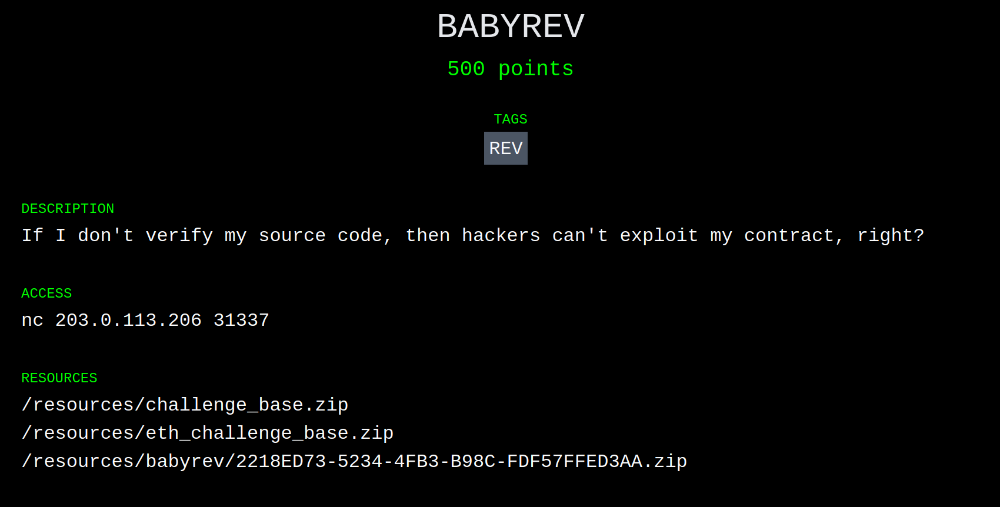

+++
title = "BABYREV Challenge - Paradigm CTF (Part 3 of 3)"
date = 2021-02-17T18:40:00Z
+++

<style>
pre {
line-height: 1.3em !important;
}
</style>

## Introduction

In my two preceding posts, I give short summaries of the [BABYCRYPTO] and [BROKER] challenges from Paradigm's recent Capture the Flag competition. If you'd like more details on the competition itself, or the format of the challenges, go and give my [BABYCRYPTO] post a read first.

Today I'll be going over the BABYREV challenge which was, by far, the longest challenge we completed during the competition. I'd also like to dedicate this post to [@adietrichs]' and my collective sanity, which unfortunately didn't survive the 10+ hours we spent on this puzzle.

Disclaimer: unlike the rest of our team, [@adietrichs] and I don't have a ton of experience auditing or reverse engineering Ethereum contracts; we're protocol researchers. The approach we take here is the most basic, brute-force approach to solving this problem, but hey, it worked!

## Challenges

### BABYREV

After a relatively successful exploit on BROKER, I joined [@adietrichs] on BABYREV. Based on the name and description, it was pretty obvious we'd be dealing with a reverse engineering puzzle.



The contents of the archive:

<pre><font color="#3465A4"><b>.</b></font>
└── <font color="#3465A4"><b>babyrev</b></font>
    └── <font color="#3465A4"><b>public</b></font>
        ├── <font color="#3465A4"><b>contracts</b></font>
        │   └── Setup.sol
        ├── <font color="#3465A4"><b>deploy</b></font>
        │   ├── chal.py
        │   ├── compiled.bin
        │   └── requirements.txt
        └── Dockerfile
</pre>

What immediately stands out is that the only contract we have is [`Setup.sol`], unlike BROKER which gave us the `Broker` contract. We do have `compiled.bin`, which is a JSON file with the output from the compiler:

```json
{
    "contracts":{
        "/private//Challenge.sol:Challenge":{
            "bin":"..."
        },
        "contracts/Setup.sol:ChallengeInterface":{
            "bin":""
        },
        "contracts/Setup.sol:Setup":{
            "bin":"..."
        }
    },
    "version":"0.4.24+commit.e67f0147.mod.Darwin.appleclang"
}
```

The rest of the archive is pretty similar to BROKER: [`Setup.sol`] checks the win condition, and there's a bunch of Docker magic that spins up a fork of mainnet for the challenge.

#### Win Condition

From [`Setup.sol`]:

```
function isSolved() public view returns (bool) {
    return challenge.solved();
}
```

Well that's *profoundly* useful. The win condition is part of the secret `Challenge` contract. I guess it's time to jump right into the EVM[^1] assembly...

#### Aside: Disassembly

The bytecode in `compiled.bin` is encoded in hexadecimal, and isn't particularly readable. Disassembly is the process of decoding the hexadecimal string into something slightly more understandable.

The basic disassembly process looks something like this:

 1. Read the first byte from the assembled program: `80`.
 2. Look up what that byte means, and for `80` that would be `DUP1` (or duplicate the top item of the stack.)
 3. If the byte encoded a `PUSH` instruction, read the immediate argument (so for `PUSH1`, read one extra byte; two for `PUSH2`; and so on.)
 4. Repeat until the entire bytecode is disassembled.

Following those steps, an input like `0x6080604052` would become:

```
PUSH1 0x80
PUSH1 0x40
MSTORE
```

Thankfully this process is automated. We used [ethervm's decompiler](https://ethervm.io/decompile), which spits out an annotated disassembly (and a decompiled version too!)

#### Further Aside: Constructors

Solidity is a wondrous beast that takes care of the complex process of deploying a contract. Unfortunately we aren't looking at Solidity, so here be dragons.

The first bytes (roughly up to the second `6080`) of a compiled contract are actually the *constructor code*, or the bits of code Solidity generates to get your contract constructed and deployed on-chain. Constructors, also known as *initcode*, take care of assigning initial storage values, populating immutable variables, and finally copying the code to be deployed into memory.

Since we aren't super interested in the constructor for this challenge, we snip it off before passing the bytecode to the disassembler.

#### `Challenge` Preamble

The first thing Solidity contracts do is ensure that the calldata is at least four bytes long:

```
entrypoint:         // Okay, I lied.
    PUSH1 0x80      // Setting up the free memory pointer is the very first
    PUSH1 0x40      // thing. The pointer lives at address 0x40 and is
    MSTORE          // initially set to 0x80. Solidity uses the first few
                    // 256-bit words of memory as scratch space.

    PUSH1 0x04      // Then we do check the calldata length.
    CALLDATASIZE
    LT
    PUSH2 0x0062
    JUMPI           // If the calldata is too short, revert (eventually.)
                    // Else, fall through into the function selector
                    // blocks.
```

The calldata must be at least four bytes long, at least in this contract, because the first four bytes are used as an identifier for the function to call. The selectors are calculated from the keccak256 hash of the function signature.

This is the first function selector block from `Challenge`:

```
selector_0adf939b:
    PUSH1 0x00
    CALLDATALOAD        // Push the 0-th word of calldata.
    PUSH29 0x0100000000000000000000000000000000000000000000000000000000
    SWAP1
    DIV
    PUSH4 0xffffffff
    AND                 // DIV+AND emulates (calldata[0] >> 224)
    DUP1
    PUSH4 0x0adf939b    // Push the function selector.
    EQ
    PUSH2 0x0067
    JUMPI               // Jump to 0x67 if the selector matches.
```

This structure is repeated for the four public functions in `Challenge`:

|    Selector    |   Signature[^2]  |
|----------------|------------------|
|  `0x0adf939b`  |        ??        |
|  `0x39ac0e49`  |        ??        |
|  `0x799320bb`  |    `solved()`    |
|  `0x799320bb`  | `solve(uint256)` |

We only succeeded in guessing one (`solve(uint256)`) of the three unknown selectors. Thankfully, we didn't need to call the others directly from Solidity. We can now expand `ChallengeInterface` with an additional function:

```solidity
interface ChallengeInterface {
    function solved() public view returns (bool);
    function solve(uint256) public;
}
```

At last our goal becomes clear: figure out some input for `solve` that makes `solved` return `true`.

#### Much Further Aside: Tools & Deadends

If you're somewhat familiar with reverse engineering, you might be wondering if we tried any tools while cracking this challenge. Well, we did, but unfortunately none of them were able to solve this puzzle. [^3]

Specifically we tried:

 - [`manticore-verifier`] - timed out
 - `gen_exploit.py` from [teether], modified - out of memory
 - [`mythril`] - no output specific to the challenge

Our failure with these tools is not a sign that they aren't useful, but rather that [@adietrichs] and I have very little experience with them. I'm sure that in the right hands, they're formidable allies.

If you look carefully at the disassembly, you'll note two large constants in the code:

 - `0x311dfa5451963f33b16e63f0c62278c9b907e43d1961cdf9f590a0c3b351c04019cccb831403`
 - `0x504354467b763332795f3533637532335f336e633279703731306e5f34313930323137686d7d`

If you look even carefully-er, you might even notice that the second constant is valid ASCII, and that it decodes to `PCTF{v32y_53cu23_3nc2yp710n_4190217hm}`. That constant, alone, is not enough to capture the flag. [^4]

#### Strategy

Without tool support, and with little else to do, we decided to manually walk through the entire contract, annotating the stack along the way. For those in the know, this is basically primitive [symbolic execution][sym]. Our eventual goal was to recover enough of the `solve` function to see exactly what path we'd need to hit. We settled on a very simple annotation format: `opcode [stack-after-opcode]`. The top (most recently pushed) of the stack would always be on the left.

A small snippet of annotated assembly would look like this:

```
PUSH1 0x10      [0x10]
PUSH1 0x59      [0x59, 0x10]
ADD             [0x69]
MLOAD           [M0]            // M0 := mload(0x69)
```

And so we began. We annotated, and we annotated some more. We annotated so much, we annotated galore. *Seriously, this took us hours.* You can see the final annotated assembly [here][gist].

#### Islands of Interest

Although annotating the assembly was slow going, we did quickly identify some sections of code that were *interesting*, and from there, reversed the important bits.

##### Comparison Subroutine

The most obviously interesting place, and the first place I started tracing, was the comparison subroutine that then stores a `true` into storage. The only `SSTORE` in the whole contract is at offset `0x1157`. If we wanted to solve the challenge, this is where we'd have to end up.

In the interest of preserving _your_ sanity, dear reader, I won't inline the entire disassembly of the comparison subroutine. Instead, here is some pseudo-code:

```solidity
function solve(uint256 C) private {
    bytes memory expected = /* ... */;
    bytes memory actual = do_some_magic(C);

    if (keccak256(actual) == keccak256(expected)) {
        storage[0x00] = (storage[0x00] & ~0xFF) | 0x01;
    }
}
```

Essentially, the final parts of the `solve` function compared the output of `do_some_magic(C)` (where `C` is under our control) to some expected value. If they matched, set `storage[0x00]`, marking the puzzle as solved.

##### The Table&trade;

The comparison function may have been the most obviously interesting, but the most perplexing section was roughly between offsets `0x0396` and `0x0D93`. This blob of instructions was surprisingly regular. It consisted of 256 repetitions of this:

```
PUSH1 0x63      // Changes every repetition
PUSH1 0xff
AND             [0x63, M_A0, M_A0, 0x00, 0x60, M_Z0, C, 0x01e1, FSEL]
DUP2            [M_A0, 0x63, M_A0, M_A0, 0x00, 0x60, M_Z0, C, 0x01e1, FSEL]
MSTORE          [M_A0, M_A0, 0x00, 0x60, M_Z0, C, 0x01e1, FSEL]        // memory@M_A0 := 0x00..0063
PUSH1 0x20      [0x20, M_A0, M_A0, 0x00, 0x60, M_Z0, C, 0x01e1, FSEL]
ADD             [M_A1, M_A0, 0x00, 0x60, M_Z0, C, 0x01e1, FSEL]
```

 - `FSEL` was the function selector.
 - `0x01e1` was the eventual return address.
 - `C` was the `uint256` argument supplied to `solve`.
 - `M_A0` and `M_Z0` were pointers to the first sections of memory regions we called `A` and `Z`. `M_A1` was the next section. I know, so creative.

It took us a fairly long while to reason out what this section of code does, but eventually it became clear that this section builds an array of 256 values (which we called The Table&trade;) in memory. Roughly, the following Solidity translates to something like The Table&trade;:

```solidity
uint8[256] memory values;
values[0] = 0x63;
values[1] = 0x7c;
values[3] = 0x77;
.
.
.
values[253] = 0x54;
values[254] = 0xbb;
values[255] = 0x16;
```

An array of 256 values is pretty suspicious. It could be a map for a substitution cipher. It could be a cleverly disguised constant that needs to be XOR'd with the input value. It was neither, but we'll come back to it later!

##### The Magic

The `do_some_magic` subroutine above covers a lot of assembly, and was pretty much a giant black box. We slowly uncovered how it worked, piece by piece. The first major milestone was discovered Sunday morning, at around 03:45:


I was referring to the subroutine around `0x1169`. In pseudo-code:

```
weird = C

/* ... */

for (j = 0; j < 32 * 8; j += 8) {
    offset = (weird >> j) && 0xff
    elem = a_arr[offset]
    new_weird |= elem << j          // add elem byte to the left
}
```

 - `C` is, again, the `uint256` from calldata.
 - `weird` [^5] is, uh, a weird number. It's used later.
 - `new_weird` is transformed from `weird`.

And in more English-like (but equally indecipherable) terms, this inner loop took `weird` and:

 1. Looked up the `j / 8`<sup>th</sup> byte in `weird` from The Table&trade;,
 2. Prepended that byte on the left hand side of `weird`, and
 3. Stored it in `new_weird`.

What kind of algorithm does something like this? **A hash function**.

What kind of algorithm breaks automated tools? **A hash function**.

What did this code end up being? **A hash function**.

#### How to Decompile a Hash Function


From this point onward it was basically just decompiling more blocks from the disassembly, and translating them into pseudo-code. Don't get me wrong, there was a ton of work, and several "Aha!" moments, but there's really not much more to write about. By early evening (for me, night for @adietrichs) on Sunday, we had reversed the whole `solve(uint256)` function, including `do_some_magic`:

```solidity
// The Table™
a_arr = hex"637c777bf26b6fc53001672bfed7ab76ca82c97dfa5947f0add4a2af9ca472c0b7fd9326363ff7cc34a5e5f171d8311504c723c31896059a071280e2eb27b27509832c1a1b6e5aa0523bd6b329e32f8453d100ed20fcb15b6acbbe394a4c58cfd0efaafb434d338545f9027f503c9fa851a3408f929d38f5bcb6da2110fff3d2cd0c13ec5f974417c4a77e3d645d197360814fdc222a908846eeb814de5e0bdbe0323a0a4906245cc2d3ac629195e479e7c8376d8dd54ea96c56f4ea657aae08ba78252e1ca6b4c6e8dd741f4bbd8b8a703eb5664803f60e613557b986c11d9ee1f8981169d98e949b1e87e9ce5528df8ca1890dbfe6426841992d0fb054bb16"

// Target String - PCTF{v32y_53cu23_3nc2yp710n_4190217hm}
t_str = hex"504354467b763332795f3533637532335f336e633279703731306e5f34313930323137686d7d"

// Weird String
b_str = hex"311dfa5451963f33b16e63f0c62278c9b907e43d1961cdf9f590a0c3b351c04019cccb831403"

weird = C

for (i = 0; i < len(b_str); i++) {
    weird_byte = weird && 0xff
    b_str[i] ^= weird_byte

    new_weird = 0x00
    for (j = 0; j < 32 * 8; j += 8) {
        offset = (weird >> j) && 0xff
        elem = a_arr[offset]
        new_weird |= elem << j          // add elem byte to the left
    }
    weird = (new_weird && 0xff) << 31 * 8 | new_weird >> 8
}

target_hash = sha3(t_str)
our_hash = sha3(b_str)

if (target_hash == our_hash) {
    // Win the thing!
    storage[0x00] = (storage[0x00] & ~0xFF) | 0x01;
}
```

The key takeaway here is that each byte of `b_str` gets overwritten with itself xor'd with the least significant byte of `weird`.

#### Computing `C`: A Rope of Sand

Now that we know _how_ `C` is used, we need to find a concrete value for `C` that correctly decodes `b_str`. Python to the rescue!

```python
# This is where I'll put the Python tool when I get it from @adietrichs
```

Because of the way this hash function is constructed, it is possible to isolate each byte of the input value, one at a time. If this were a real hash function (like SHA-3), there'd be mixing between the bytes, making this process practically impossible.

Now that we know `C`, we can craft the attack transaction, and solve the challenge.

# Conclusion

This concludes my mini-series on Paradigm's CTF competition. Thanks for sticking it out, and I hope you enjoyed it.

If you'd like to see some of our team's other solutions, check out:

 - [BANK](https://smarx.com/posts/2021/02/writeup-of-paradigm-ctf-bank/) by [@smarx]
 - [VAULT](https://smarx.com/posts/2021/02/writeup-of-paradigm-ctf-vault/) also by [@smarx]
 - JOP [Part 1](https://www.twitch.tv/videos/907645638) and [Part 2](https://www.twitch.tv/videos/906353891) (solved after the competition) by [@adietrichs]
 - [UPGRADE](https://hackmd.io/@adietrichs/paradigm-ctf-2021) by [@adietrichs]

A huge thank you to Paradigm for putting this whole thing together. It was a blast!

## Footnotes

[^1]: *Ethereum Virtual Machine*, the abstract computer simulated by Ethereum, that Solidity targets.

[^2]: It is infeasible to recover the function signature given the selector, but [4byte.directory](https://www.4byte.directory/) provides a public database mapping selectors to known signatures.

[^3]: Likely intentional on the puzzlesmith's part!

[^4]: No matter how much you want it to be.

[^5]: _I_ called this `ACC` (for accumulator), but [@adietrichs]' `weird` won out in the end. What do you want? It's a weird number.

[BABYCRYPTO]: @/posts/paradigm-ctf/index.md
[BROKER]: @/posts/paradigm-ctf-broker/index.md
[@adietrichs]: https://twitter.com/adietrichs
[`Setup.sol`]: ./Setup.sol
[`manticore-verifier`]: https://manticore.readthedocs.io/en/latest/verifier.html
[teether]: https://github.com/nescio007/teether
[`mythril`]: https://github.com/ConsenSys/mythril
[sym]: https://en.wikipedia.org/wiki/Symbolic_execution
[gist]: https://gist.github.com/SamWilsn/f850807af39bdddbb88bbe44c787e376
[@smarx]: https://twitter.com/smarx
