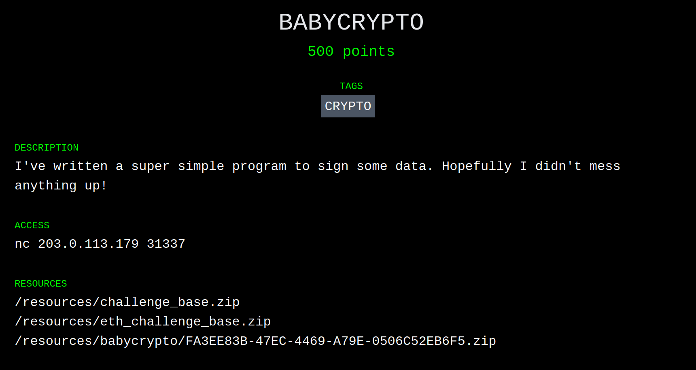

+++
title = "BABYCRYPTO Challenge - Paradigm CTF (Part 1 of 3)"
date = 2021-02-12T22:45:00Z
+++

<style>
pre {
line-height: 1.3em !important;
}
</style>

## Introduction

Paradigm, a crypto-focused investment firm, hosted a capture-the-flag style competition over the past weekend with over $10,000 in prizes split among the top three teams. Our team, dilicious[^1] [^2], competed and took first place, solving 15 out of a possible 17 challenges.

If you aren't familiar with the term, a capture-the-flag competition (at least in the software industry) is a cyber-security challenge where participants exploit vulnerabilities to achieve goals (analogous to capturing the flag in meatspace.)

This particular competition was focused on the Ethereum blockchain and related technologies.

### Our Team

Our team, in alphabetical order by the first letters of our Twitter usernames:

 * [@adietrichs](https://twitter.com/adietrichs) [^3]
 * [@GNSPS](https://twitter.com/GNSPS)
 * [@joranhonig](https://twitter.com/joranhonig)
 * [@lethalspoons](https://twitter.com/lethalspoons)
 * [@lightclients](https://twitter.com/lightclients) [^3]
 * [@sbetamc](https://twitter.com/sbetamc)
 * [@\_SamWilsn\_](https://twitter.com/_SamWilsn_) [^3]
 * [@smarx](https://twitter.com/smarx)
 * [@vwuestholz](https://twitter.com/vwuestholz)
 * [@wadeAlexC](https://twitter.com/wadeAlexC)
 * [@wolflo0](https://twitter.com/wolflo0)

Go follow them or something, I don't know.

## Challenges

The competition was split into 17 challenges, covering topics from reverse engineering, to cryptography, to market manipulation. Considering I'm an expert in exactly zero of those fields, I'm quite surprised I have anything to write up!

### BABYCRYPTO

The first challenge I opened was BABYCRYPTO. Considering the name, it seemed like the second easiest challenge (after HELLO, which @adietrichs had already taken) and I figured if I was going to be able to contribute anything, it would be here.

Clicking the challenge, I was greeted by a pleasantly green-and-black page:

 _Top points to Paradigm for the hacker-esque vibe._

Based on my minutes of experience in other software puzzle games, I suspected that this might be a XOR cypher or a Caesar square, so I quickly downloaded all three of the challenge zips, and spent the next half-an-hour or so setting up Docker and building images. The Dockerfiles in the archives turned out to be the biggest red herring of the entire weekend, tricking several of us into a bunch of work that was ultimately pointless. [^4]

The contents of the three BABYCRYPTO archives:

<pre><font color="#3465A4"><b>.</b></font>
├── <font color="#3465A4"><b>babycrypto</b></font>
│   └── <font color="#3465A4"><b>public</b></font>
│       ├── <font color="#3465A4"><b>deploy</b></font>
│       │   ├── chal.py
│       │   └── requirements.txt
│       └── Dockerfile
├── <font color="#3465A4"><b>challenge_base</b></font>
│   ├── 00-create-xinetd-service
│   ├── 99-start-xinetd
│   ├── Dockerfile
│   ├── <font color="#4E9A06"><b>entrypoint.sh</b></font>
│   └── <font color="#4E9A06"><b>handler.sh</b></font>
└── <font color="#3465A4"><b>eth_challenge_base</b></font>
    ├── 98-start-gunicorn
    ├── Dockerfile
    └── <font color="#3465A4"><b>eth_sandbox</b></font>
        ├── auth.py
        ├── hashcash.py
        ├── __init__.py
        ├── launcher.py
        └── server.py
</pre>

The ~~only important~~ file I chose to focus on was `chal.py`, which ended up being a good place to start for most of the future challenges too.

Here is `chal.py` in its entirety:

```python
from random import SystemRandom
from ecdsa import ecdsa
import sha3
import binascii
from typing import Tuple
import uuid
import os


def gen_keypair() -> Tuple[ecdsa.Private_key, ecdsa.Public_key]:
    """
    generate a new ecdsa keypair
    """
    g = ecdsa.generator_secp256k1
    d = SystemRandom().randrange(1, g.order())
    pub = ecdsa.Public_key(g, g * d)
    priv = ecdsa.Private_key(pub, d)
    return priv, pub


def gen_session_secret() -> int:
    """
    generate a random 32 byte session secret
    """
    with open("/dev/urandom", "rb") as rnd:
        seed1 = int(binascii.hexlify(rnd.read(32)), 16)
        seed2 = int(binascii.hexlify(rnd.read(32)), 16)
    return seed1 ^ seed2


def hash_message(msg: str) -> int:
    """
    hash the message using keccak256, truncate if necessary
    """
    k = sha3.keccak_256()
    k.update(msg.encode("utf8"))
    d = k.digest()
    n = int(binascii.hexlify(d), 16)
    olen = ecdsa.generator_secp256k1.order().bit_length() or 1
    dlen = len(d)
    n >>= max(0, dlen - olen)
    return n


if __name__ == "__main__":
    flag = os.getenv("FLAG", "PCTF{placeholder}")

    priv, pub = gen_keypair()
    session_secret = gen_session_secret()

    for _ in range(4):
        message = input("message? ")
        hashed = hash_message(message)
        sig = priv.sign(hashed, session_secret)
        print(f"r=0x{sig.r:032x}")
        print(f"s=0x{sig.s:032x}")

    test = hash_message(uuid.uuid4().hex)
    print(f"test=0x{test:032x}")

    r = int(input("r? "), 16)
    s = int(input("s? "), 16)

    if not pub.verifies(test, ecdsa.Signature(r, s)):
        print("better luck next time")
        exit(1)

    print(flag)
```

With the `requirements.txt` file, I was able to get the program to run locally:

<pre>
message?
</pre>

This is Python3, so that rules out any shenanigans with `input` vs. `raw_input`. I didn't notice any other particularly interesting points in the code itself, so that means it must _actually be a cryptography challenge!_

Oh god. Its ECDSA. I knew I should've paid more attention in my undergraduate cryptography class. I was about to ask @adietrichs if I could take a look at HELLO instead, when I noticed this interesting pattern:

<pre>
message? wanna switch?
<font color="#3465A4">r=0xe430b3a398f2320556eef81c1c523ea5ae0a920f493c8376eafcb0dc9cd75b89</font>
s=0x4a19d0b156a9d10b0a86b729316909cdc8634ec23aa38f5f891e2599fc316a81
message? no
<font color="#3465A4">r=0xe430b3a398f2320556eef81c1c523ea5ae0a920f493c8376eafcb0dc9cd75b89</font>
s=0x43d8ec82d7b6b1f3c8ed41b0ba682d5291f6d4a922a57729fa716dccd0f237d6
message? &lt;/3
<font color="#3465A4">r=0xe430b3a398f2320556eef81c1c523ea5ae0a920f493c8376eafcb0dc9cd75b89</font>
s=0xbbfb7b34c31f025bddb8724a53dae7dd5a17c489587b881b8ed0dc5453c07e87
</pre>

The `r` values for the three different messages were the same! As established earlier, I'm no cryptography expert, and I have no idea what `r` actually means, but I **do** know that you should get different outputs when signing different inputs, so off to search the internet!

<video style="width: 100%" src="./aha.mp4" controls autoplay loop muted>
    <p>
        Your browser doesn't seem to support <a href="./aha.mp4">this video</a>.
        You aren't missing much. Just me searching the internet for what to do
        with a repeated <code>r</code> value.
    </p>
</video>

Aha! We have our vulnerability. Repeating something about something lets you extract the private key.

A little more searching around turned up a plethora of git repositories claiming to be able to extract a private key based on this vulnerability. A few moments later, and I had this script:

```python
from ecdsa import ecdsa, SigningKey
from ecdsa.numbertheory import inverse_mod
from hashlib import sha1

g = ecdsa.generator_secp256k1
publicKeyOrderInteger = g.order()

r = "e430b3a398f2320556eef81c1c523ea5ae0a920f493c8376eafcb0dc9cd75b89"
sA = "4a19d0b156a9d10b0a86b729316909cdc8634ec23aa38f5f891e2599fc316a81"
sB = "43d8ec82d7b6b1f3c8ed41b0ba682d5291f6d4a922a57729fa716dccd0f237d6"

hashA = "24281772548044994405505787307091019721595367071300198475142035580469771474091"
hashB = "56710668495515998944273818574660611208941006033402527734960197520384934694586"

r1 = int(r, 16)
s1 = int(sA, 16)
s2 = int(sB, 16)

#Convert Hex into Int
L1 = int(hashA, 10)
L2 = int(hashB, 10)

numerator = (((s2 * L1) % publicKeyOrderInteger) - ((s1 * L2) % publicKeyOrderInteger))
denominator = inverse_mod(r1 * ((s1 - s2) % publicKeyOrderInteger), publicKeyOrderInteger)

privateKey = numerator * denominator % publicKeyOrderInteger

print(privateKey)
```

The constants:

 * `g` is the particular curve that `chal.py` used.
 * `r` is the shared value from the two signatures.
 * `sA` and `sB` are the `s` values from the two signatures.
 * `hashA` and `hashB` are the outputs of `hash_message` in the original script, for the given inputs.

The output:

<pre>
82639917221039576394263609841358608750060353480659277072454055536914923163809
</pre>

Hack that back into the original program (by modifying `gen_keypair`) and you can sign arbitrary messages! [^5]

# Conclusion

Well, that's it! That's all of BABYCRYPTO. Stay tuned for two more posts on the BROKER and BABYREV challenges.

## Footnotes

[^1]: Although I wasn't part of the subcommittee on team naming, I'm pretty sure dilicious is just diligence plus delicious.

[^2]: It took me longer than I care to admit to realize that diligence is actually ConsenSys Diligence, and my confusion explains why [this](./dill.jpg) was our Discord server's icon, instead of something relevant.

[^3]: Actually part of ConsenSys Quilt, not Diligence.

[^4]: I've been informed that the Docker containers would've let us test solutions locally, but I still assert they were a red herring.

[^5]: Apologies if you were looking for any in-depth analysis of how the ECDSA private key recovery actually works. You can find the repository I used as a starting point [here][ecdsa]. It has comments!

[ecdsa]: https://github.com/Marsh61/ECDSA-Nonce-Reuse-Exploit-Example/blob/master/Attack-Main.py
