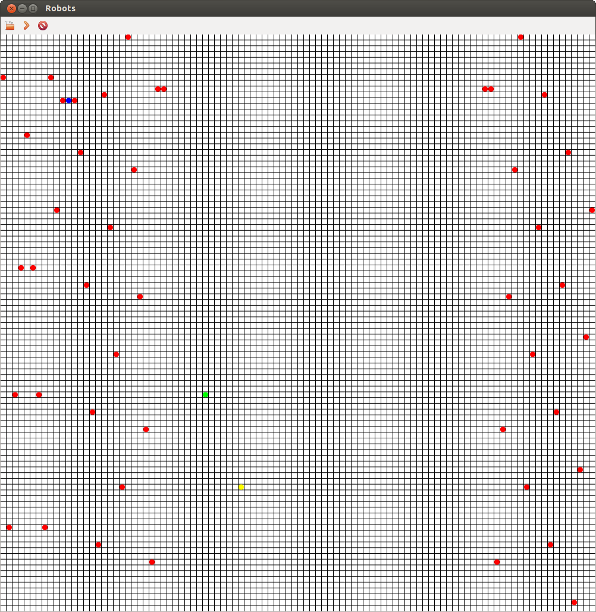

+++
title = "Robots!"
date = 2012-06-10T11:44:00-07:00

aliases = ['/2012/06/robots.html']
+++

If you've been around me in the past couple of days, you've probably heard me talking endlessly about robots, and possibly PyPy, and my trials and tribulations with RPython.  I've been working pretty hard on building something fun that isn't a website, and I think I've succeeded, at least at entertaining myself.

A little bit of back story would probably be useful here.  I first got interested in programming when I read about Java, back in the early 2000s.  I saw a magazine in a news stand proclaiming the awesomeness of Sun's baby, and had to buy it.  Thankfully as a ten year old, my money was practically non-existent and I was unable to acquire it.  I forgot about programming for months, until Christmas rolled around and my parents bought me Borland's C++ with a Sam's Teach Yourself C++ in 21 days.

After miserably failing to wrap my brain around pointers, I began looking at other ways to program, and I eventually discovered AT Robots, Corewars, and other awesome games.  These games, especially Robocom, are what inspired tonight's project.

I give you Robots!  This is my way of saying thank you to those who got me interested in programming (I hope no one ever finds this post, since its a fairly terrible thank you, but I digress.)

In Robots! you program a single robot whose goal is to eliminate the other Robot teams on the field.  Robots can move, scan, replicate and transfer instructions between each other.  The user interface is limited to a grid with coloured circles, or an even worse command line interface, but I think it gets the point across:



The game is played on a 100 by 100 grid where the edges wrap around, torus style.

Robots are programmed in a very simple assembly like language that is interpreted by an RPython program.  The game state is transferred to the user interface, which is written in full Python with wxPython and Cairo.

A sample Robot program:

```
:start
build $left

:program
set L1 :end
sub L1 1

:program-loop
if $lt L1 :new
jump (:start)       ' Exit the loop when the counter reaches :new

set L0 L1           ' Copy source location to L0
sub L0 :new         ' Make relative to :start

xfer $left L1 L0    ' Transfer the new instruction from L1 to L0
sub L1 1
jump (:program-loop)

:new
go $up
jump (:new)
:end
```

This simple program builds copies of itself and sends them on their merry way around the board.

Feel free to take a look at the code over on GitHub and play around:

[https://github.com/tecywiz121/robots](https://github.com/tecywiz121/robots)
